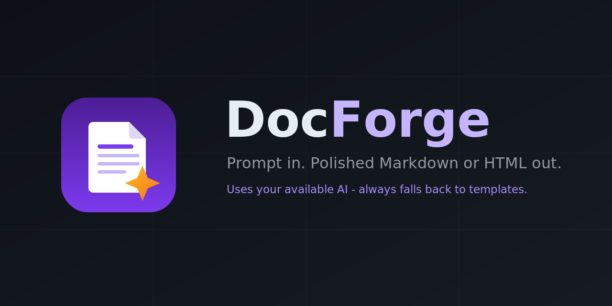
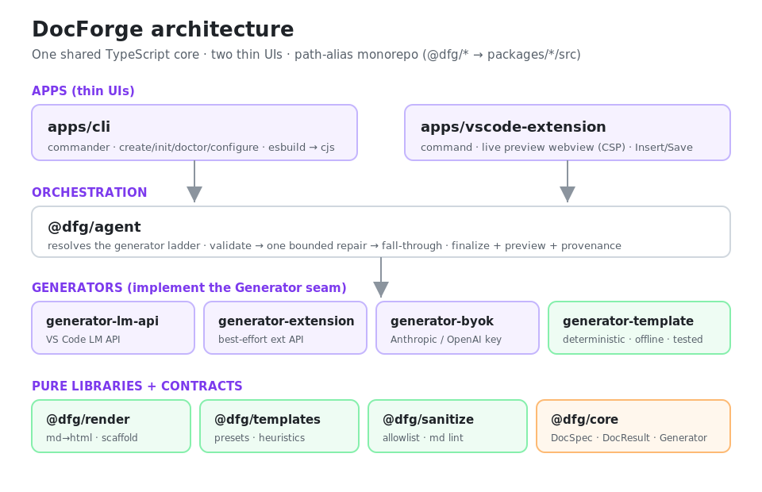
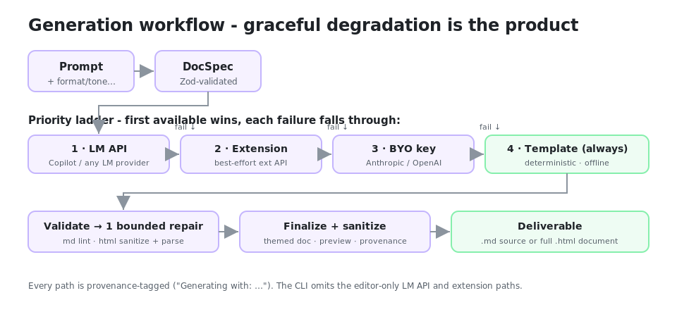

<p align="center">
  
</p>

<p align="center">
  <a href="https://github.com/aniketsoni1/doc-forge/actions/workflows/ci.yml"></a>
  
  
  = 20" />
  
</p>

# DocForge

**Type a prompt, get a polished `.md` or `.html` file - with a live preview.** DocForge is a
deterministic-first document generator. It uses whatever AI capability you already have and **always
has a working offline fallback**, so it never hard-fails just because no AI is installed.

One shared TypeScript core powers two thin UIs: a cross-platform **CLI** (`docforge`) and a **VS Code
extension**.

## Why DocForge

- **Graceful degradation is the product.** Every failure - no model, no key, quota, offline - falls
  through to the next generator and ends at a deterministic template. You always get a document.
- **Provenance is never a mystery.** DocForge always tells you which generator ran
  (`Generating with: Copilot (VS Code LM API)` / `BYO key` / `Built-in templates`).
- **Safe by construction.** All model HTML is sanitized against an allowlist before it is written or
  shown, and every webview uses a strict Content-Security-Policy.
- **Local-first.** The CLI and the template generator work fully offline. AI/network is opt-in and
  disclosed. No telemetry.

## Feature overview

- Prompt → **Markdown** or sanitized, themed, printable **HTML**
- Six deterministic presets: `readme`, `blog`, `report`, `landing`, `changelog`, `letter`
- Prompt heuristics (title, sections, feature lists) drive the template path
- A single `Generator` seam with a transparent **priority ladder**
- Live preview, generator picker, Insert / Save, and diff + approval before overwrite
- Bring-your-own-key (Anthropic / OpenAI) in both the CLI and the extension

## The generator ladder

DocForge resolves the best available generator in this order and uses the first one that works:

| # | Generator | Where | Notes |
| - | --------- | ----- | ----- |
| 1 | **VS Code Language Model API** | Editor | Sanctioned, vendor-neutral (Copilot + others) |
| 2 | **Compatible AI extension** | Editor | Best-effort, via a documented `generateDocument` API |
| 3 | **Bring-your-own-key** | CLI + Editor | Anthropic / OpenAI; key in SecretStorage / env |
| 4 | **Built-in templates** | Everywhere | Deterministic, offline, always available - the tested path |

The CLI omits the editor-only paths (1 and 2). If a generator errors or produces output that a single
bounded repair pass can't fix, DocForge falls through to the next one.

## Quick start

```bash
git clone https://github.com/aniketsoni1/doc-forge.git
cd docforge
npm install
npm run verify          # typecheck (src + ext) + lint + tests + smoke

# Generate from source (no build needed in dev)
npm run docforge -- create "README for a CLI tool called Acme with features: fast, tiny, typed" --no-ai
```

## CLI usage

```bash
# Markdown to stdout, offline template generator
docforge create "Report on Q3 sales performance" --no-ai

# Themed, sanitized HTML written to a file (extension inferred)
docforge create "Landing page for a note app" --format html --template landing --output landing

# Use your own key (falls back to templates automatically if unset)
export ANTHROPIC_API_KEY=sk-...
docforge create "Changelog for v2.0" --template changelog

# Environment & availability
docforge doctor
```

Key flags for `create`: `--format md|html`, `--template <id>`, `--tone`, `--length`, `--title`,
`--model`, `--output <path>`, `--no-ai` (force templates), `--non-interactive`, `--force`. Overwriting
an existing file shows a diff and asks for confirmation.

Other commands: `docforge init` (write `docforge.config.json`), `docforge doctor`, `docforge configure`.

## VS Code extension

Install the VSIX (see below), then run **DocForge: New Document from Prompt** (`Ctrl/Cmd+Alt+D`):

1. Describe the document.
2. Pick a format and a generator (Auto / a specific model / Built-in templates).
3. Review the live, themed, sanitized preview.
4. **Insert** into the editor or **Save** to disk. **Regenerate** to try again.

Untrusted workspaces use the offline template generator only. Set a BYO key with **DocForge: Set API
Key** (stored in SecretStorage, never in settings).

## Configuration

CLI (environment variables, local-only):

| Variable | Purpose |
| --- | --- |
| `ANTHROPIC_API_KEY` / `OPENAI_API_KEY` / `DOCFORGE_API_KEY` | Enable BYO-key generation |
| `DOCFORGE_PROVIDER` | `anthropic` or `openai` |
| `DOCFORGE_MODEL` | Model id |
| `DOCFORGE_FORMAT` | Default `md` or `html` |

Extension settings: `docforge.defaultFormat`, `docforge.tone`, `docforge.length`, `docforge.enableAi`,
`docforge.provider`, `docforge.model`.

## Privacy & security

Local-first by default; the template generator is fully offline. AI generators are opt-in and
disclosed, and DocForge respects Workspace Trust. **All model output is untrusted:** generated HTML is
sanitized (scripts, inline handlers, and unsafe URLs stripped) before it is written or shown, and every
webview sets a strict CSP. Keys live in SecretStorage (extension) or environment variables (CLI) and
are never written to settings or logs. See [`SECURITY.md`](SECURITY.md).

## Architecture

Path-alias monorepo (`@dfg/* → packages/*/src`); no per-package build in dev - tsx, Vitest, and esbuild
resolve the aliases directly.



Generation workflow (graceful degradation):



More detail in [`docs/ARCHITECTURE.md`](docs/ARCHITECTURE.md).

```
apps/       cli/  vscode-extension/
packages/   core  render  templates  sanitize  configuration
            reporting  agent  testing
            generator-template  generator-byok
samples/  docs/  assets/  scripts/  .github/
```

## Examples

Genuine output from the deterministic template path (regenerate with `npx tsx scripts/emit-samples.mjs`):

```markdown
# Acme

> This document covers a CLI tool called Acme.

## Overview
...
## Features

- fast
- tiny
- typed

## Installation
...
```

Open these in a browser to see the real rendered output:

- [`samples/q3-report.html`](samples/q3-report.html) - themed, sanitized HTML document
- [`samples/preview-webview.html`](samples/preview-webview.html) - the extension's actual CSP preview page
- [`samples/acme-readme.md`](samples/acme-readme.md), [`samples/acme-changelog.md`](samples/acme-changelog.md)

> **On UI screenshots:** the icon, hero, logo, and diagrams above are original, reproducibly generated
> assets. Screenshots of the running extension inside the VS Code UI require a live editor session -
> a precise, repeatable capture checklist is in [`docs/CAPTURE.md`](docs/CAPTURE.md). This repository
> deliberately ships **no placeholder or mocked UI images**.

## Install the VS Code extension (from VSIX)

```bash
npm run build:ext
npm run package:vsix       # -> artifacts/docforge-<version>.vsix (+ .sha256)
npm run verify:vsix        # audits the packaged contents
code --install-extension artifacts/docforge-0.1.1.vsix
```

## Limitations

- The template generator produces a well-structured **scaffold** with placeholder prose; rich drafting
  comes from an AI generator.
- The "compatible AI extension" path is best-effort and only activates for a documented
  `generateDocument` API.
- VS Code UI screenshots and the demo GIF are produced manually (see `docs/CAPTURE.md`); they are not
  auto-captured in this environment.
- PDF/DOCX export and streaming preview are on the roadmap, not yet implemented.

## Roadmap

- Section-level regeneration ("improve this section", "make it shorter")
- Preset & prompt library shareable across a team
- Export beyond md/html (PDF / DOCX)
- Streaming preview and a token/cost display for AI generations
- Prompt caching for instant, offline re-open

## Contributing

See [`CONTRIBUTING.md`](CONTRIBUTING.md) and [`CODE_OF_CONDUCT.md`](CODE_OF_CONDUCT.md). Run
`npm run verify` before opening a PR.

## License

[Apache-2.0](LICENSE) © `aniketsoni1`
